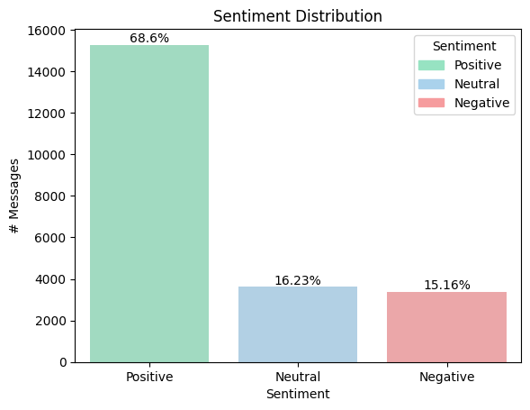
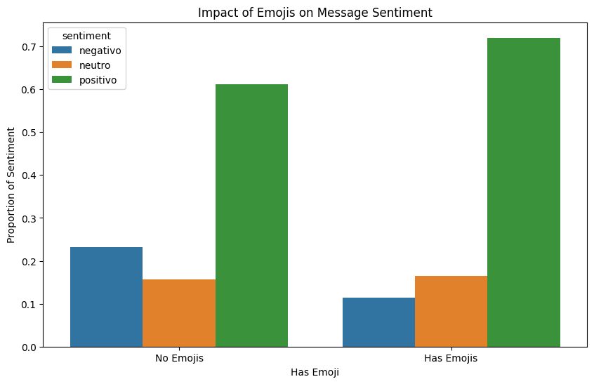

# Genios Studio
## Data Science Technical Test

## Table of Contents

- [Genios Studio](#genios-studio)
  - [Data Science Technical Test](#data-science-technical-test)
  - [Table of Contents](#table-of-contents)
  - [Overview](#overview)
  - [Project Structure](#project-structure)
  - [Requirements](#requirements)
  - [SetUp](#setup)
    - [Installation](#installation)
    - [Environment](#environment)
  - [File Descriptions](#file-descriptions)
  - [Exploratory Data Analysis (EDA)](#exploratory-data-analysis-eda)
    - [Key Insights](#key-insights)
  - [Exploratory Data Analysis (EDA)](#exploratory-data-analysis-eda-1)
    - [Model Used: BERT for Sequence Classification](#model-used-bert-for-sequence-classification)
    - [Performance Metrics](#performance-metrics)
  - [Future Enhancements and Limitations](#future-enhancements-and-limitations)
    - [Exploratory Data Analysis (EDA):](#exploratory-data-analysis-eda-2)
    - [Machine Learning (ML):](#machine-learning-ml)
    - [Automation and Deployment:](#automation-and-deployment)
  - [Author](#author)
  - [License](#license)

## Overview

This project analyzes social media data using various Python scripts (`clean_data.ipynb`, `read_data.ipynb`, `eda.ipynb`, and `transformers.ipynb`) to perform tasks such as data cleaning, exploratory data analysis (EDA), and sentiment analysis using BERT for sequence classification.

## Project Structure

The project consists of the following files:

- `clean_data.ipynb`: Cleans and preprocesses raw social media data.
- `read_data.ipynb`: Reads and formats raw data into a structured CSV.
- `eda.ipynb`: Conducts exploratory data analysis (EDA) on the cleaned data.
- `transformers.ipynb`: Implements sentiment analysis using BERT (Bidirectional Encoder Representations from Transformers).

## Requirements

To run the project, ensure you have the following installed:

- Python (version >= 3.x)
- Jupyter Notebook
- pandas
- nltk
- emoji
- seaborn
- matplotlib
- scikit-learn
- transformers (Hugging Face library)
- wordcloud


## SetUp
### Installation
Clone the repository and install the required packages:

```
git clone <repository-url>
cd <repository-folder>
pip install -r requirements.txt
```
### Environment

Ensure you have Python 3.7+ installed. It's recommended to use a virtual environment (venv or conda) for managing dependencies.

## File Descriptions

- **read_data.ipynb**  
This notebook reads and preprocesses the raw data into a cleaned CSV format suitable for analysis and modeling.

- **clean_data.ipynb**
This notebook cleans the raw social media data, including removing nulls, duplicates, normalizing text, and extracting features like emojis and sentiment.

- **eda.ipynb**
This notebook performs Exploratory Data Analysis (EDA) on the cleaned dataset, visualizing message lengths, word frequencies, sentiment distributions, temporal analysis, emoji presence, and user-specific insights.

- **transformers.ipynb**
This notebook implements a machine learning model using BERT for sentiment analysis on the preprocessed data.

## Exploratory Data Analysis (EDA)
### Key Insights

During the exploratory analysis of the dataset, several trends and patterns emerged that shed light on the sentiment and impact of emojis in the comments. Of these trends, I want to highlight the following three:

 1. **Sentiment Analysis:** A bar plot illustrates that a significant majority of comments exhibit positive sentiment. This observation underscores the predominantly positive nature of the dataset.



  1. **Common Words:** A word cloud visualization provides a clear depiction of the most frequently used words in the comments, emphasizing that larger words are predominantly positive in nature. This graphical representation enhances understanding of the prevalent sentiment conveyed through the comments.


  3. **Emoji Impact:** Contrary to the assumption that more emojis indicate greater positivity, a bar plot analysis demonstrates that the presence of emojis varies significantly across messages. While positive messages often incorporate emojis, negative messages tend to utilize them less frequently.



## Exploratory Data Analysis (EDA)

### Model Used: BERT for Sequence Classification

We employed **BERT (Bidirectional Encoder Representations from Transformers)** for sequence classification, specifically using the **dccuchile/bert-base-spanish-wwm-uncased model.** This choice was driven by the need for a transformer-based architecture capable of handling Spanish text effectively. BERT, known for its bidirectional context understanding and pre-trained representations, provided a robust framework to capture nuanced semantic meanings in Spanish-language comments.

The **dccuchile/bert-base-spanish-wwm-uncased** variant was selected due to its pre-training on a large corpus of Spanish text, which aligns closely with the linguistic characteristics of our dataset. This model's **uncased** nature further facilitates consistency and comparability in text processing by treating all text as lowercase.

In the model implementation process detailed in transformers.ipynb, we undertook several critical steps:

**Data Selection:** We curated a dataset suitable for sentiment analysis in Spanish, ensuring diversity and relevance to our application domain.

**Model Training:** The BERT model was fine-tuned on our labeled dataset using techniques such as transfer learning. This involved adapting the pre-trained BERT weights to our specific sentiment analysis task.

**Model Evaluation:** Throughout training, we monitored the model's performance using standard evaluation metrics to ensure its effectiveness in capturing sentiment nuances.

### Performance Metrics

We evaluated the model's performance using the following metrics across three epochs:
```
Epoch 1:

Accuracy: 0.7600
Precision: 0.6609
Recall: 0.7600
F1-score: 0.7065

Confusion Matrix:
[[ 18   0  12]
 [  3   0  23]
 [  9   1 134]]

Epoch 2:

Accuracy: 0.8150
Precision: 0.8243
Recall: 0.8150
F1-score: 0.8124

Confusion Matrix:
[[ 15   8   7]
 [  1  15  10]
 [  2   9 133]]

Epoch 3:

Accuracy: 0.7750
Precision: 0.7605
Recall: 0.7750
F1-score: 0.7599

Confusion Matrix:
[[ 21   3   6]
 [  3   6  17]
 [ 13   3 128]]


Final Results on Test Data:

Accuracy: 0.7750
Precision: 0.7605
Recall: 0.7750
F1-score: 0.7599

Confusion Matrix:
[[ 21   3   6]
 [  3   6  17]
 [ 13   3 128]]
```
These metrics collectively demonstrate the model's ability to classify sentiment in Spanish text with reasonable accuracy, precision, recall, and F1-score, as validated on the test set. The confusion matrices further illustrate the distribution of predicted sentiment labels compared to ground truth across different epochs and on the final evaluation.

## Future Enhancements and Limitations

Due to the two-day testing period, it's important to note that there is still a wealth of untapped information within this dataset.

### Exploratory Data Analysis (EDA):

- Investigating Themes in Negative Messages: Further exploration can     reveal specific topics or issues driving negativity among users with the most negative comments.

- Identifying Positive Sentiment Drivers: Analyzing messages from top positive users could uncover the key topics or aspects generating the highest positive sentiment.

### Machine Learning (ML):

- Model Performance: While achieving good accuracy, there is scope to enhance precision and recall, particularly for the neutral class.

- Class Imbalance: The confusion matrices suggest a potential class imbalance, with the model exhibiting stronger performance on the positive class.

- Overfitting: The observed dip in performance from epoch 2 to epoch 3 hints at possible overfitting. Regularly monitoring validation loss and implementing early stopping strategies could mitigate this issue.

- Hyperparameter Tuning: Experimenting with various learning rates, batch sizes, and epochs is crucial to identifying optimal settings tailored to the dataset.

- Data Augmentation: Increasing dataset size through data augmentation techniques or acquiring more labeled data can bolster the model's robustness.

### Automation and Deployment:

- Automation with Python Scripts: Transitioning from Jupyter notebooks to Python scripts can automate data preprocessing, model training, and evaluation processes.

- Integration with Streamlit: Displaying results in interactive web applications via tools like Streamlit can enhance accessibility and usability for stakeholders.

These enhancements and considerations pave the way for deeper insights and improved performance in sentiment analysis and model deployment.

## Author
César Chirino
Email: chirinocesar.me@gmail.com
LinkedIn: César Chirino on LinkedIn

## License
MIT License
Copyright (c) 2024 César Chirino